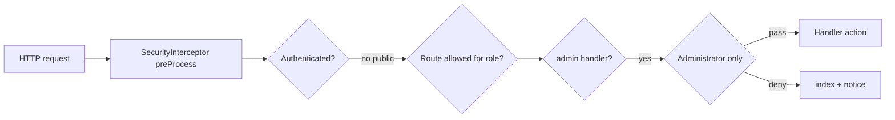

# Admin module — Issue #47

**Plan file:** this document — [`.cursor/plans/admin_issue_47.plan.md`](admin_issue_47.plan.md) (does not replace [rbac_issue_36.plan.md](rbac_issue_36.plan.md)).

**GitHub:** [Feature: Admin module #47](https://github.com/mattburnett-repo/servepoint/issues/47)

## Context (from codebase)

- **Auth:** Session `userId`, [SecurityService.cfc](../../services/SecurityService.cfc) (`authenticate`, bcrypt `verifyBCryptHash`, `loginUser` / `logout`).
- **Passwords:** [Users.cfc](../../models/Users.cfc) persists bcrypt via `setPassword`; login path already verifies hashes — no plain-text requirement for new work unless seed/demo docs need a tweak.
- **Coarse RBAC:** [SecurityInterceptor.cfc](../../interceptors/SecurityInterceptor.cfc) — **Administrator currently has access to all non-public routes**, while Case Manager / Citizen are restricted. **Gap:** any new `admin` handler actions would be reachable by Case Manager today unless you add an **explicit Administrator-only branch** for the admin namespace.

## Phase A — Foundation (ship first)

1. **Routes** — In [config/Router.cfc](../../config/Router.cfc), register an explicit admin entry (e.g. `GET /admin` → `admin.index`) *before* the conventions route so URLs are stable and documented. Optional: `GET /admin/...` pattern for future subpages.

2. **Handler + view** — Add `handlers/Admin.cfc` with `index` (and default `layout` if needed). Add `views/admin/index.cfm` using the same layout pattern as other secured pages ([layouts/Main.cfm](../../layouts/Main.cfm)).

3. **Administrator-only gate** — Extend `isAuthorizedForRole` in [SecurityInterceptor.cfc](../../interceptors/SecurityInterceptor.cfc): if the current handler is `admin` (case-insensitive match on `event.getCurrentHandler()`), **only** `User_Role` Administrator may proceed; others get the same deny path as today (`session.servepointAuthzNotice` + `relocate( main.index )`). This is the server-side enforcement the issue calls for, separate from “data in `users.role`” for UI-only checks.

4. **In-browser “future implementations”** — On `views/admin/index.cfm`, add a secondary card/aside listing roadmap items from the issue (user/role management, cases including archived + restore, richer admin logging) and **non-goals** (no change to normal document-delete UX, no LDAP/OAuth UI, no hard-archive exports). Style as muted help content so it reads as roadmap, not broken features.

5. **Nav (optional but small)** — In [layouts/Main.cfm](../../layouts/Main.cfm), show an **Admin** link when `prc.currentUserRole` is Administrator (mirror existing Reports visibility pattern).

6. **Tests** — Integration spec: authenticated **Case Manager** (or Citizen) denied for `admin.index`; **Administrator** allowed; unauthenticated still redirected to login (existing interceptor behavior).

7. **Design docs** — Per [mermaid-design-sync.mdc](../rules/mermaid-design-sync.mdc), update [design/mermaid/request-lifecycle.md](../../design/mermaid/request-lifecycle.md) and [design/mermaid/architecture.md](../../design/mermaid/architecture.md) briefly: `/admin` route, interceptor admin gate, `Admin` handler.

## Phase B — Deferred “admin-y” work (after foundation)

Track as follow-ups (issue subtasks or comments); not required to close Phase A.

- **Users / roles management** — CRUD or limited edit for `Users` and valid `User_Role` values under `/admin/...`.
- **Cases (archived)** — Use existing `CaseService.listAll( includeArchived = true )` ([CaseService.cfc](../../services/CaseService.cfc)); restore flows where [archive/restore](../../tests/specs/integration/case/ArchiveRestoreSpec.cfc) already applies.
- **LogBox** — Use existing `audit.admin` in [config/LogBox.cfc](../../config/LogBox.cfc); log structured lines (actor id, action, target) from admin mutations when they exist.

## Explicit non-goals (unchanged from issue)

- Deleting accepted case documents from the normal documents UI.
- Full permission matrix beyond Administrator for the admin area, LDAP/OAuth UI, or “hard archive” exports.

## Files likely touched in Phase A

| Area     | Files                                                                                                                                                    |
| -------- | -------------------------------------------------------------------------------------------------------------------------------------------------------- |
| Routing  | [config/Router.cfc](../../config/Router.cfc)                                                                                                             |
| Authz    | [interceptors/SecurityInterceptor.cfc](../../interceptors/SecurityInterceptor.cfc)                                                                       |
| Admin UI | `handlers/Admin.cfc`, `views/admin/index.cfm`                                                                                                            |
| Nav      | [layouts/Main.cfm](../../layouts/Main.cfm)                                                                                                               |
| Tests    | `tests/specs/integration/...` (new or extend existing pattern)                                                                                           |
| Design   | [design/mermaid/request-lifecycle.md](../../design/mermaid/request-lifecycle.md), [design/mermaid/architecture.md](../../design/mermaid/architecture.md) |
