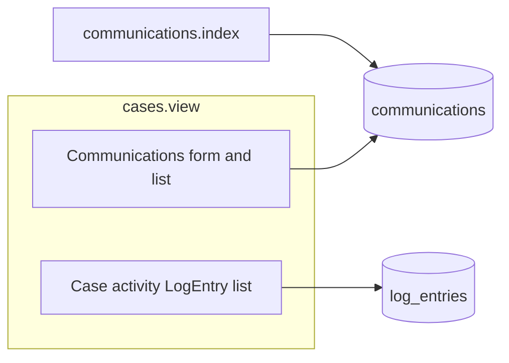

# Staff communications + case activity (Issue #34)

## Product shape (from thread)

| Surface         | Behavior                                                                                                                                                                               |
| --------------- | -------------------------------------------------------------------------------------------------------------------------------------------------------------------------------------- |
| **Case detail** | Two blocks: **Communications** (POST new note + list) and **Case activity** (read-only `LogEntry` rows, e.g. archive/restore).                                                         |
| **Comms hub**   | Read-only list of all `communications`, filters: **case**, **type**, **author** (real `users` only; no “System” on hub). Unfiltered = all rows, **newest first**. Pagination deferred. |
| **Home**        | [handlers/Main.cfc](handlers/Main.cfc) — set **Staff communication tools** `href` to the hub route (same pattern as case/doc links).                                                   |

## Schema and migration

- New **cfmigrations** file under [resources/database/migrations/](resources/database/migrations/) (timestamp after existing migrations).
- Table **`communications`**:
  - `communication_id` SERIAL PK
  - `case_id` NOT NULL → `cases(case_id)`
  - `user_id` NOT NULL → `users(user_id)` (author; **never NULL**)
  - `updated_by` INTEGER NULL → `users(user_id)` (NULL until edit flow exists)
  - `message` TEXT NOT NULL
  - `type` VARCHAR(255) NOT NULL
  - `date_created` / `date_updated` TIMESTAMP NOT NULL, defaults `CURRENT_TIMESTAMP` (align with [cases](resources/database/migrations/2026_03_14_000001_bootstrap_schema.cfc) / [2026_03_27_000002_timestamp_defaults.cfc](resources/database/migrations/2026_03_27_000002_timestamp_defaults.cfc))
- Add indexes: `case_id`, `user_id`, `type`.
- Optional but consistent: **BEFORE UPDATE** trigger on `communications` to set `date_updated` (mirror `tr_cases_date_updated` pattern in `2026_03_27_000002_timestamp_defaults.cfc`). On **insert**, `updated_by` stays NULL; service layer sets `date_updated` equal to created time if not relying on defaults only.

## Models and constants

- **`models/constants/Communication_Type.cfc`** — single allowed value for MVP (extend later); `getValues()` like [Log_Entry_Type.cfc](models/constants/Log_Entry_Type.cfc).
- **`models/Communication.cfc`** (table `communications`) — `cborm.models.ActiveEntity`, PK `communicationId`, properties mapped to snake_case columns (`message`, `type`, `dateCreated`, `dateUpdated` with `insert=false` `update=false` if DB/trigger-owned, matching [Cases.cfc](models/Cases.cfc)), `many-to-one` to `Cases` and `Users` (author + `updatedBy`).
- **`models/Cases.cfc`** — add `one-to-many` `communications` → `Communication` `fkcolumn="case_id"`.
- **`models/Users.cfc`** — add `one-to-many` to `Communication` for `user_id` / `updated_by` if needed for ORM navigation (follow existing `logEntries` pattern in [Users.cfc](models/Users.cfc)).

## Service layer

- **`services/CommunicationService.cfc`** (singleton), registered in [config/WireBox.cfc](config/WireBox.cfc) like `CaseService`:
  - **`listForCase( caseId )`** — active case only; order newest first; returns array of `Communication` (or DTO-friendly structs if you prefer).
  - **`createCommunication( caseId, userId, message, type )`** — validate case via `CaseService.getActiveCase()` (same “active only” rule as [handlers/Cases.cfc](handlers/Cases.cfc) `view`); validate `type` against `Communication_Type`; enforce `message` max length (e.g. align with case description 10000); persist with `user_id` set; leave `updated_by` null.
  - **`listForHub( caseId?, type?, userId? )`** — HQL/criteria with optional filters; unfiltered returns all; sort `dateCreated DESC` (or `date_updated` if you want “last touched”; thread agreed **newest** — default to **created** unless you document otherwise).

## Seed data (communications)

Extend [services/SeedService.cfc](services/SeedService.cfc):

- Add **`seedCommunications()`**, invoked from **`runAll()`** after **`seedCases()`** (ordering relative to `seedDocuments()` is arbitrary; cases must exist first).
- **Idempotent** (align with [seedDocuments](services/SeedService.cfc)): recommended approach — if **any** `Communication` rows exist, **return early** (simplest). Alternative: skip only when a deterministic marker exists (e.g. known message prefix on a seeded case) if you need re-seed after manual deletes; document in [DEV_NOTES.md](DEV_NOTES.md) if non-obvious.
- **Content**: seed **2–4** demo messages across the two seeded cases (“Sample Service Request”, “In-progress Case”), using **different authors** where possible (e.g. `admin@example.com` and `case.manager@example.com`) so **hub author filter** and case detail are meaningful out of the box.
- Use the **single** `Communication_Type` constant for `type`; **`updated_by`** NULL on insert.

## Handlers and routing

- Conventions routing already covers `/:handler/:action?` in [config/Router.cfc](config/Router.cfc); no router change required unless you want a prettier path (optional).
- **`handlers/Communications.cfc`** — `index`: GET only; read `rc` filter params (`caseId`, `type`, `authorUserId` or similar); inject `CommunicationService` + load `entityLoad("Users")` or a small user list for filter dropdowns; `prc.communications`, `prc.cases` (e.g. `CaseService.listActive()` or `listAll` for archived-case filter UX — **thread**: filter by case implies listing cases; use `listActive()` for dropdown unless you need archived).
- **`handlers/Cases.cfc`** — extend **`view`**: load communications for `prc.caseEntity.getCaseId()` and activity (`LogEntry` for case — use `prc.caseEntity.getLogEntries()` or ordered query if collection order is undefined). Add **`addCommunication`** (or `postCommunication`): POST only; resolve author like **`cases.create`** ([handlers/Cases.cfc](handlers/Cases.cfc) lines 154–167) — `admin@example.com` fallback + `entityLoad("Users")`; call `CommunicationService.createCommunication`; on success `relocate` back to `cases.view?id=…` with flash notice; on failure re-render `cases/view` with `prc.errorMessage` and repopulate comms + activity + existing `prc` fields (mirror `update` error path).

## Views

- **`views/cases/view.cfm`** — after existing summary/edit card (order per taste): **Communications** card — form POST to `cases.addCommunication` (hidden `caseId`), textarea `message`, submit; list with author name, `date_created` (and `type` if useful). **Case activity** card — loop `log_entries`-backed entities: `entryText`, `type`, `date_created`, user label; no form. Use `encodeForHTML` / `encodeForHTMLAttribute` like existing markup.
- **`views/communications/index.cfm`** — filter form (GET to `communications.index`): case select, type select (from constant), author select (users). Results table with case link to `cases.view`, message snippet, author, timestamps, type.

## Home page

- [handlers/Main.cfc](handlers/Main.cfc) — `event.buildLink("communications.index")` for Staff communication tools (line 12).

## Tests (TestBox)

- **Seeding:** [tests/specs/integration/system/SeedingSpec.cfc](tests/specs/integration/system/SeedingSpec.cfc) — after `runAll()`, assert **communications exist** on a fresh DB (or equivalent); keep **double `runAll()`** idempotency (no duplicate demo comms if using global “any row exists” guard).
- New integration spec e.g. **`tests/specs/integration/communication/CommunicationsSpec.cfc`** (extend [tests.specs.BaseIntegrationTestCase](tests/specs/BaseIntegrationTestCase.cfc) like [CasesSpec.cfc](tests/specs/integration/case/CasesSpec.cfc)):
  - Service: create communication on active case; reject invalid type / empty message; reject inactive/archived case if enforced.
  - Handler: `communications.index` renders; filter by case narrows rows.
  - Handler: POST `cases.addCommunication` creates row and redirects.
  - `cases.view` includes communications + shows activity when `LogEntry` exists (optional: archive case in test and assert activity text — reuse patterns from [ArchiveRestoreSpec.cfc](tests/specs/integration/case/ArchiveRestoreSpec.cfc)).

## Design docs (workspace rule)

Update in the same PR or immediately after:

- [design/mermaid/data-model.md](design/mermaid/data-model.md) — ER: `cases` → `communications`, columns, indexes; clarify **`log_entries`** = activity only; note **seed** supplies demo comms in dev.
- [design/mermaid/class-diagram.md](design/mermaid/class-diagram.md) — `Communication`, relationships, `Communication_Type`.
- [design/mermaid/request-lifecycle.md](design/mermaid/request-lifecycle.md) — `communications.index`, `cases.addCommunication`, case view sections.

## Out of scope (explicit)

- Edit/delete communication UI (schema ready with `date_updated` / `updated_by`).
- Pagination on hub.
- RBAC beyond current demo user resolution.
- Changing how [CaseService.archiveCase](services/CaseService.cfc) writes `LogEntry` (unchanged).

## GitHub Issue #34

Edit the issue body to state: staff messages live in **`communications`**; **`log_entries`** remain **case activity**; hub is comms-only; **SeedService** adds idempotent demo communications; supersede earlier “reuse LogEntry for staff notes” wording.
