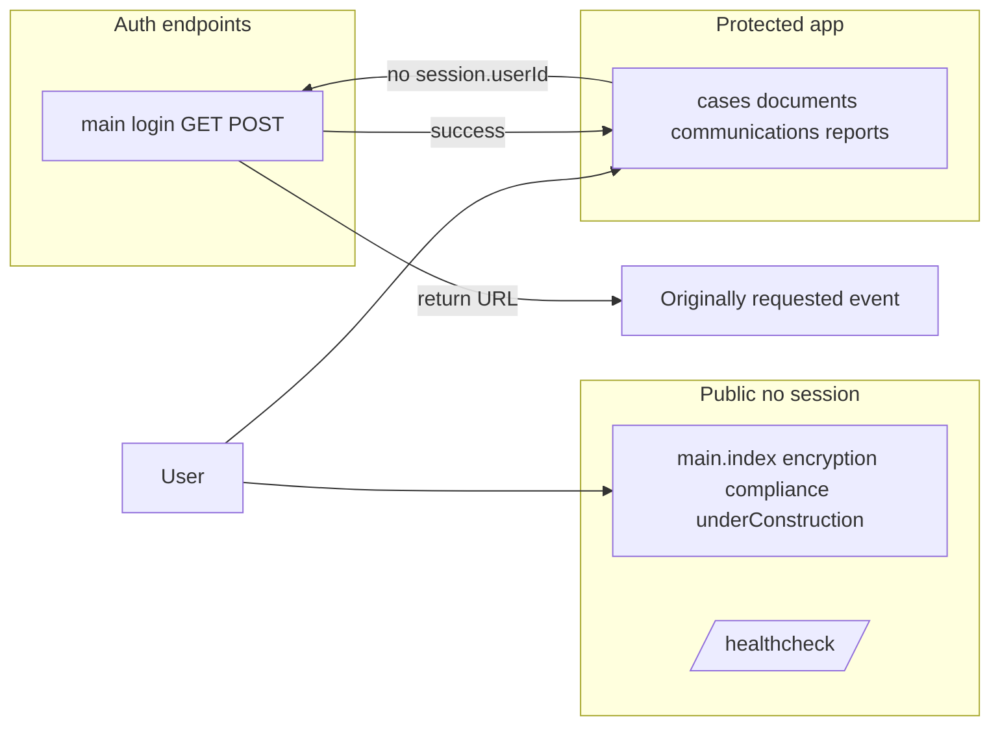

# Phase 1 — Authentication (Milestone A)

**Parent:** [GitHub issue #36](https://github.com/mattburnett-repo/servepoint/issues/36) (full RBAC spans Phase 1 + Phase 2).

**Next plan (do not run until this milestone is done):** [`rbac_issue_36_phase2.plan.md`](rbac_issue_36_phase2.plan.md)

## Reference

- Roles and users already exist: [`models/constants/User_Role.cfc`](models/constants/User_Role.cfc), [`models/Users.cfc`](models/Users.cfc), seeds in [`services/SeedService.cfc`](services/SeedService.cfc).
- Handlers still use hard-coded `admin@example.com` — **replacing that is Phase 2**, not this milestone.

## Exclusions (Phase 2)

Do **not** implement in this milestone: RBAC matrix, role-based interceptor rules, CaseService/handler authorization refactors, replacing `admin@example.com`, or the “Role-based access controls” Core Feature in-app page.

## Target behavior

- **`session.userId`** identifies the logged-in `Users` row.
- **Public:** `main.index`, `main.encryption`, `main.compliance`, `main.underConstruction`, `/healthcheck`, and **login GET/POST** (must stay allowlisted).
- **Protected:** all other convention routes (e.g. `main.data`, `main.doSomething` unless added to public list).
- **Lazy auth:** unauthenticated access to a protected route → relocate to login with **return URL**; after login → relocate to that URL.
- **`/`:** always show landing; no forced redirect to dashboard for logged-in users.
- **Phase 1 only establishes *who* the user is** — not *what* they may do (Phase 2).

## Implementation checklist

1. **`SecurityService`** ([`config/WireBox.cfc`](config/WireBox.cfc)): resolve user from `session.userId`; `getCurrentUser()`; `isAuthenticated()`; password verification for login (bcrypt on [`Users`](models/Users.cfc)). Optional: stub `hasRole()` for Phase 2 or defer entirely. Adobe CF: avoid fragile one-liner `new ...().getValues()` chains per repo rules.
2. **Login / logout** on `Main` (or dedicated handler): POST validates credentials; set `session.userId`; logout clears session user; **return URL** documented and implemented consistently.
3. **ColdBox interceptor** (`interceptors/`, register in [`config/Coldbox.cfc`](config/Coldbox.cfc)): `preProcess` — if event not in **public allowlist** and no `session.userId` → relocate to login with return URL. **No role enforcement.**
4. **`prc.currentUser`** when session present (interceptor or helper).
5. **Layouts / nav:** minimal login view; login link when anonymous, user + logout when authenticated; preserve landing layout/content.

## Testing ([`tests/specs/integration/`](tests/specs/integration/))

- Unauthenticated GET to a protected route → relocate to login with return URL; with `session.userId` (or full login in harness), same route succeeds — **no role checks**.
- Update integration specs that assumed anonymous access to cases, reports, documents, etc.
- [`tests/specs/BaseIntegrationTestCase.cfc`](tests/specs/BaseIntegrationTestCase.cfc) transaction pattern.

## Documentation

- [`docs/DEV_NOTES.md`](docs/DEV_NOTES.md): `session.userId`, login/logout events, return URL, seeded accounts for QA.
- [`design/mermaid/request-lifecycle.md`](design/mermaid/request-lifecycle.md): auth interceptor + login (per [mermaid-design-sync](../rules/mermaid-design-sync.mdc)).
