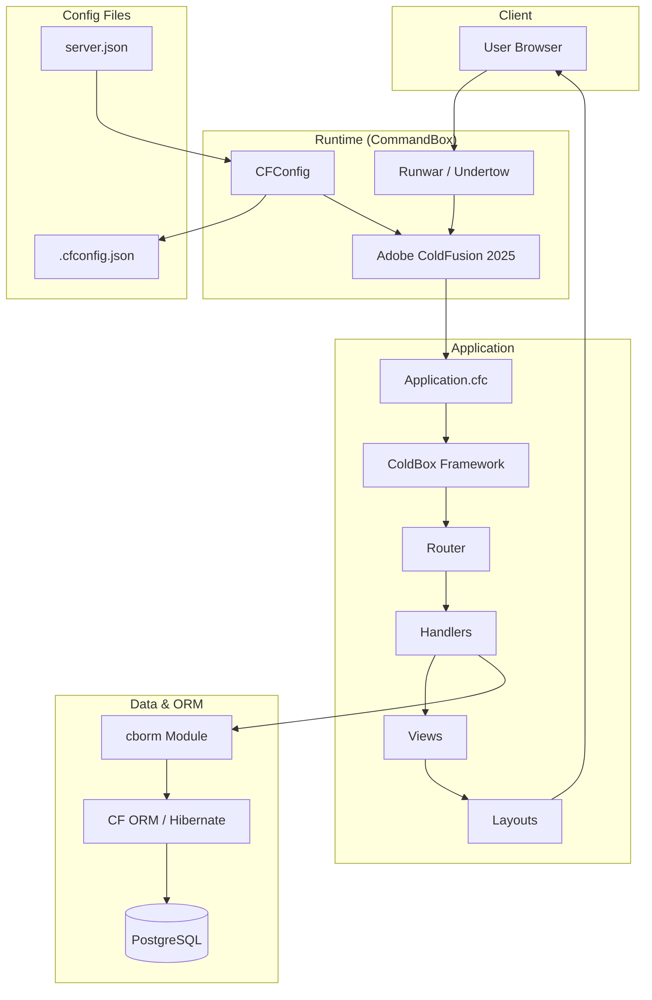

# ServePoint Architecture

High-level stack and component flow for the ServePoint ColdBox application.

## Layer summary

| Layer    | Components |
|----------|------------|
| Client   | Browser |
| Runtime  | CommandBox, Runwar, CFConfig, Adobe CF 2025 |
| App      | Application.cfc, ColdBox, Router, Handlers, Views, Layouts |
| Data     | cborm, CF ORM, PostgreSQL |
| Config   | server.json, .cfconfig.json |
