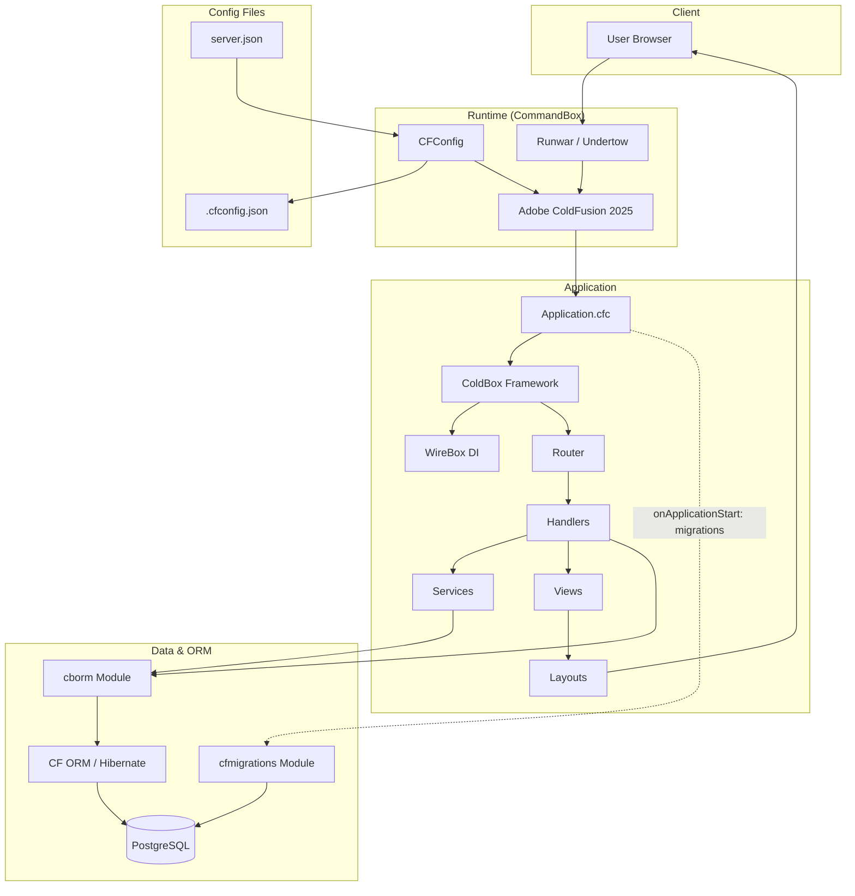

# ServePoint Architecture

High-level stack and component flow for the ServePoint ColdBox application.

## Layer summary

| Layer    | Components |
|----------|------------|
| Client   | Browser |
| Runtime  | CommandBox, Runwar, CFConfig, Adobe CF 2025 |
| App      | Application.cfc, ColdBox, WireBox, Router, Handlers, Services (e.g. CaseService, SeedService), Views, Layouts |
| Data     | cborm, cfmigrations (startup migrations), CF ORM, PostgreSQL |
| Config   | server.json, .cfconfig.json |

## Handlers and services (current)

| Handler | Injected / used services | Primary views |
|---------|---------------------------|----------------|
| `Main` | — | `main/index`, `main/underConstruction` |
| `Cases` | `CaseService` | `cases/index`, `cases/view`, `cases/new` |
| `Documents` | `DocumentService`, `CaseService` | `documents/index`; upload/download actions (no in-app document delete—retention policy; see `DESIGN_NOTES.md`) |

`SeedService` runs during `onApplicationStart` when `SERVEPOINT_AUTO_SEED` allows it (see Application.cfc).

**Documents:** Upload, list, and download are in scope for the case workspace; **deletion** of accepted documents is **out of band** (policy / separate process), not a handler action in the MVP.
