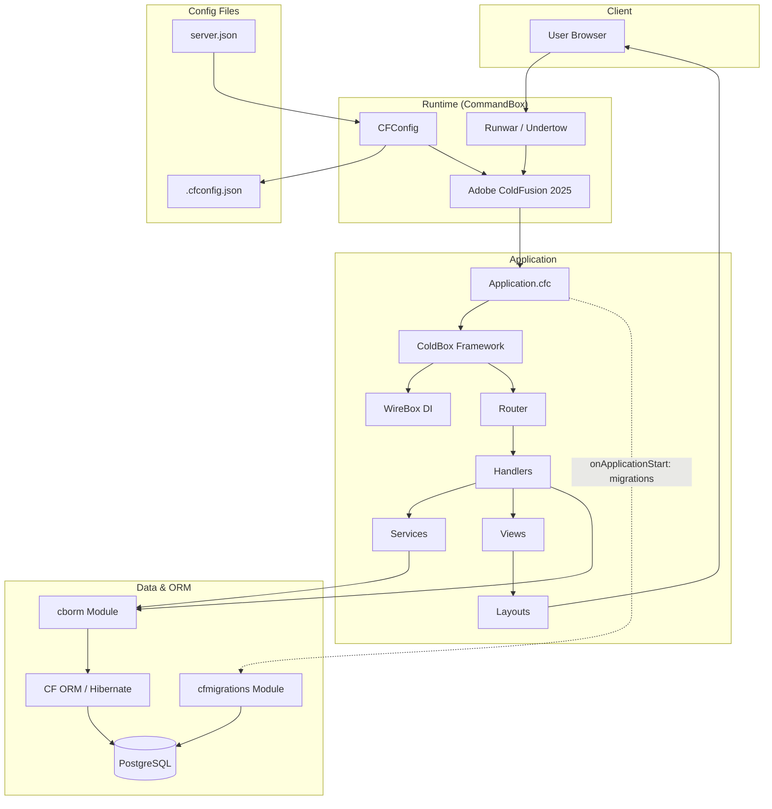

# ServePoint Architecture

High-level stack and component flow for the ServePoint ColdBox application.

```mermaid
flowchart TB
    subgraph Client["Client"]
        Browser[User Browser]
    end

    subgraph Runtime["Runtime (CommandBox)"]
        Runwar[Runwar / Undertow]
        CFConfig[CFConfig]
        ACF[Adobe ColdFusion 2025]
    end

    subgraph App["Application"]
        AppCfc[Application.cfc]
        ColdBox[ColdBox Framework]
        WireBox[WireBox DI]
        Router[Router]
        Handlers[Handlers]
        Services[Services]
        Views[Views]
        Layouts[Layouts]
    end

    subgraph Data["Data & ORM"]
        cborm[cborm Module]
        cfmigrations[cfmigrations Module]
        ORM[CF ORM / Hibernate]
        PG[(PostgreSQL)]
    end

    subgraph Config["Config Files"]
        serverJson[server.json]
        cfconfigJson[.cfconfig.json]
    end

    Browser --> Runwar
    Runwar --> ACF
    serverJson --> CFConfig
    CFConfig --> cfconfigJson
    CFConfig --> ACF
    ACF --> AppCfc
    AppCfc --> ColdBox
    ColdBox --> WireBox
    ColdBox --> Router
    Router --> Handlers
    Handlers --> Services
    Handlers --> Views
    Views --> Layouts
    Layouts --> Browser
    Services --> cborm
    Handlers --> cborm
    cborm --> ORM
    ORM --> PG
    AppCfc -.->|"onApplicationStart: migrations"| cfmigrations
    cfmigrations --> PG
```

## Layer summary

| Layer    | Components |
|----------|------------|
| Client   | Browser |
| Runtime  | CommandBox, Runwar, CFConfig, Adobe CF 2025 |
| App      | Application.cfc, ColdBox, WireBox, Router, Handlers, Services (e.g. CaseService, CommunicationService, ReportsService, SeedService), Views, Layouts |
| Data     | cborm, cfmigrations (startup migrations), CF ORM, PostgreSQL |
| Config   | server.json, .cfconfig.json |

## Handlers and services (current)

| Handler | Injected / used services | Primary views |
|---------|---------------------------|----------------|
| `Main` | — | `main/index`, `main/encryption` (summary: TLS + document encryption), `main/compliance` (demo privacy/compliance posture; links to `docs/compliance/`), `main/underConstruction`, `main/healthcheck` → `main/healthcheckOk` / `main/healthcheckDown` (no layout; `/healthcheck` route) |
| `Cases` | `CaseService`, `CommunicationService` | `cases/index`, `cases/view`, `cases/new`; `addCommunication` (POST) |
| `Communications` | `CommunicationService`, `CaseService` | `communications/index` (read-only hub) |
| `Reports` | `ReportsService`, `AuditLoggerService` | `reports/index` (audit-event aggregate reporting) |
| `Documents` | `DocumentService`, `CaseService` | `documents/index`; upload/download actions (no in-app document delete—retention policy; see `docs/DESIGN_NOTES.md`) |

`SeedService` runs during `onApplicationStart` when `SERVEPOINT_AUTO_SEED` allows it (see Application.cfc).

Audit writes are centralized in `AuditLoggerService`, which persists structured rows to `audit_events` and emits category-scoped LogBox lines (`audit.security`, `audit.case`, `audit.document`, `audit.report`, `audit.admin`).

**Documents:** Upload, list, and download are in scope for the case workspace; **deletion** of accepted documents is **out of band** (policy / separate process), not a handler action in the MVP.
