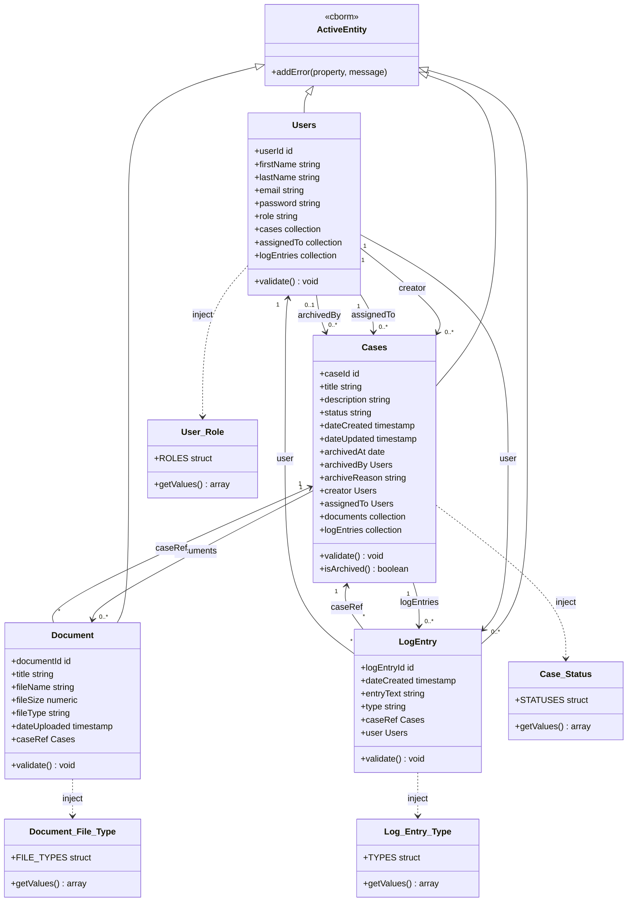

# ServePoint Models – Class Diagram

Class diagram for CFCs in the `models` folder. Persistent entities extend `cborm.models.ActiveEntity`. Constants live in `models/constants/` and are injected for validation and option lists.

## Legend

| Symbol / text | Meaning |
|----------------|--------|
| `<\|--` | Inheritance (entity extends ActiveEntity) |
| `-->` | Association / relationship (e.g. many-to-one) |
| `..>` | Dependency (injected constant component under `models.constants`) |
| `<<cborm>>` | Stereotype: provided by cborm module |

## Notes

- **Persistent entities**: table-backed; `validate()` runs on ORM save where configured.
- **Document**: modeled as a retained case attachment; the product design intentionally **does not** map an in-app delete lifecycle here—see `DESIGN_NOTES.md` / `DEV_NOTES.md` (Document retention).
- **Constants**: structs of allowed values and `getValues()` for validation and UI; not persisted.
- **Services** (`services/CaseService.cfc`, etc.) are not shown here; they orchestrate ORM and live outside `models/`.
