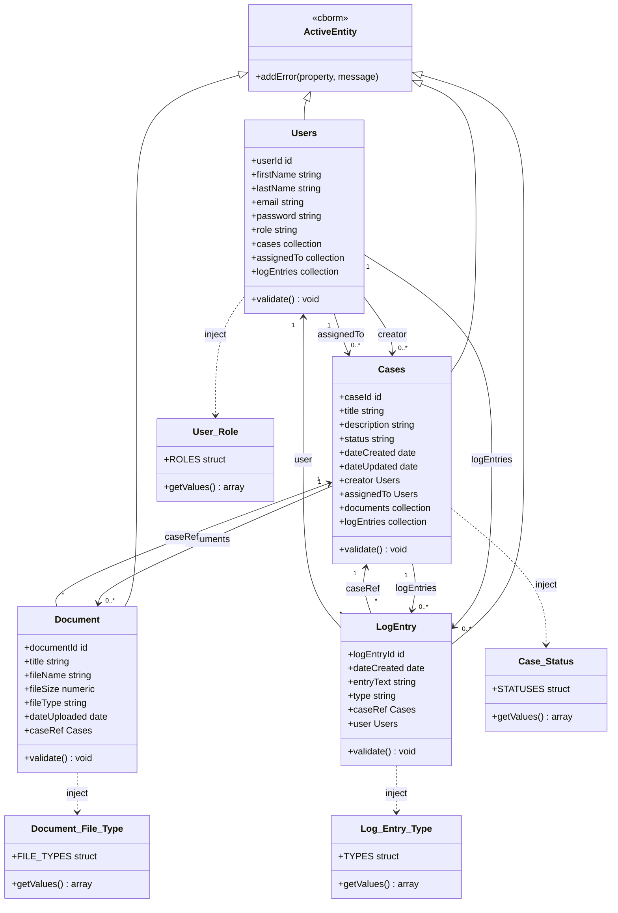

# ServePoint Models – Class Diagram

Class diagram for CFCs in the `models` folder. Persistent entities extend `cborm.models.ActiveEntity`; constants are plain components used for validation and option lists.

## Legend

| Symbol / text | Meaning |
|----------------|--------|
| `<\|--` | Inheritance (entity extends ActiveEntity) |
| `-->` | Association / relationship (e.g. many-to-one) |
| `..>` | Dependency (injected constant component) |
| `<<cborm>>` | Stereotype: provided by cborm module |

## Notes

- **Persistent entities** (Users, Cases, Document, LogEntry): table-backed; `validate()` is called by ORM before save and uses the injected constant to check allowed values.
- **Constants** (User_Role, Case_Status, Document_File_Type, Log_Entry_Type): hold structs of allowed values and expose `getValues()` for validation and UI options. Not persisted.
