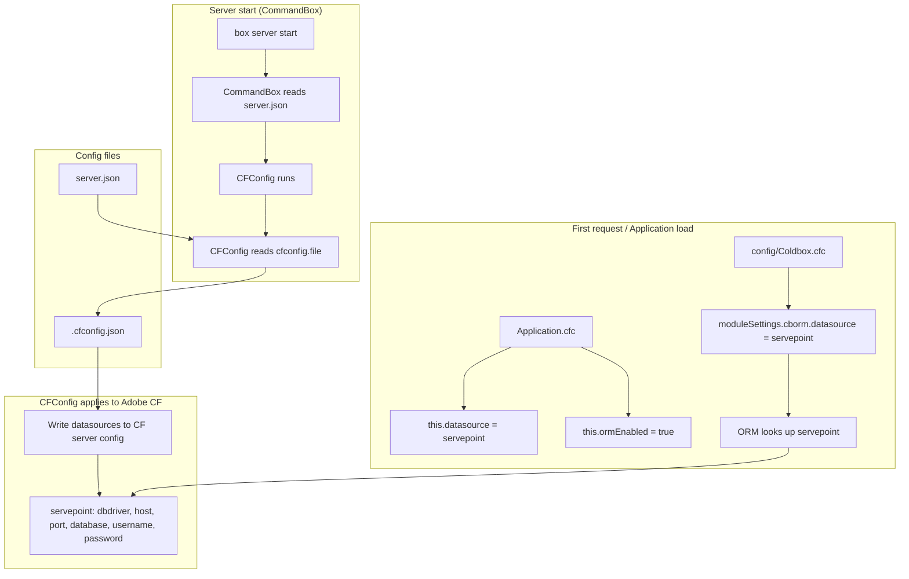

# Config and Datasource Flow

How server and application configuration and the PostgreSQL datasource are loaded.

## Who reads what

| Consumer   | File / source        | Purpose |
|-----------|----------------------|--------|
| CommandBox | server.json         | Server name, engine (adobe@2025), JVM, web, **cfconfig.file**, scripts |
| CFConfig  | server.json → cfconfig.file | Path to config JSON (e.g. .cfconfig.json) |
| CFConfig  | .cfconfig.json      | Datasource `servepoint`, caches, other CF settings; applied to Adobe CF at startup |
| Adobe CF  | (in-memory after CFConfig) | Registered datasources (e.g. servepoint) |
| Application.cfc | (code)         | this.datasource = "servepoint", this.ormEnabled, this.ormSettings |
| Coldbox.cfc | (code)            | moduleSettings.cborm.datasource = "servepoint", orm options |

## Future: env/secrets

Values in `.cfconfig.json` can be replaced with placeholders (e.g. `${DB_HOST:localhost}`, `${DB_PASSWORD}`) and provided via `.env.dev` or container environment so no secrets are stored in the repo.
