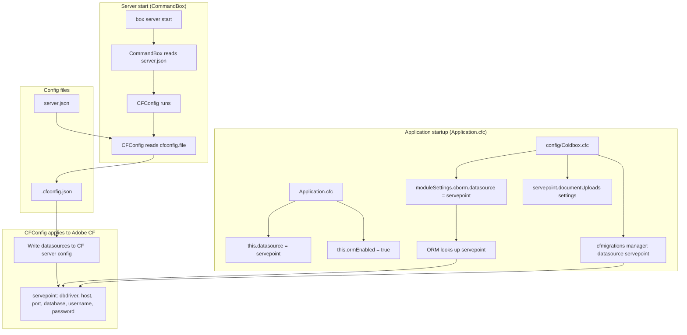

# Config and Datasource Flow

How server and application configuration and the PostgreSQL datasource are loaded, including migrations and ORM-related environment variables.

## Who reads what

| Consumer        | File / source               | Purpose                                                                                                                   |
| --------------- | --------------------------- | ------------------------------------------------------------------------------------------------------------------------- |
| CommandBox      | server.json                 | Server name, engine (adobe@2025), JVM, web, **cfconfig.file**, scripts                                                    |
| CFConfig        | server.json → cfconfig.file | Path to config JSON (e.g. .cfconfig.json)                                                                                 |
| CFConfig        | .cfconfig.json              | Datasource `servepoint`, caches, other CF settings; applied to Adobe CF at startup                                        |
| Adobe CF        | (in-memory after CFConfig)  | Registered datasources (e.g. servepoint)                                                                                  |
| Application.cfc | (code)                      | `this.datasource = "servepoint"`, `this.ormEnabled`, `this.ormSettings` (includes `ORM_DBCREATE` env, default `validate`) |
| Coldbox.cfc     | (code)                      | `moduleSettings.cborm.datasource`, cborm ORM options; `moduleSettings.cfmigrations` → `resources/database/migrations`     |
| cfmigrations    | (startup)                   | `migrationService.up()` before `ormGetSessionFactory()`                                                                   |

## Environment variables (relevant)

| Variable                           | Role                                                                                                        |
| ---------------------------------- | ----------------------------------------------------------------------------------------------------------- |
| `ORM_DBCREATE`                     | ORM schema mode (`validate`, `update`, `dropcreate`, `none`); defaults to `validate` if unset or invalid    |
| `SERVEPOINT_AUTO_SEED`             | When truthy, `SeedService.runAll()` after ORM init; default when unset is to seed                           |
| `SERVEPOINT_DOCUMENT_STORAGE_ROOT` | Absolute/relative root directory for persisted uploaded document files                                      |
| `SERVEPOINT_DOCUMENT_TEMP_ROOT`    | Temporary upload directory used as staging before validation and move to `SERVEPOINT_DOCUMENT_STORAGE_ROOT` |
| `SERVEPOINT_DOCUMENT_MAX_BYTES`    | Maximum allowed upload size in bytes; defaults to `10485760` (10 MB)                                        |
| `SERVEPOINT_STORAGE_PERSISTENT`    | Boolean flag for storage-mode messaging (`true` persistent mode, `false` ephemeral demo mode)               |

## Future: env/secrets

Values in `.cfconfig.json` can be replaced with placeholders (for example `${DB_HOST:localhost}`, `${DB_PASSWORD}`) and provided via `.env` or container environment so secrets are not stored in the repo.
