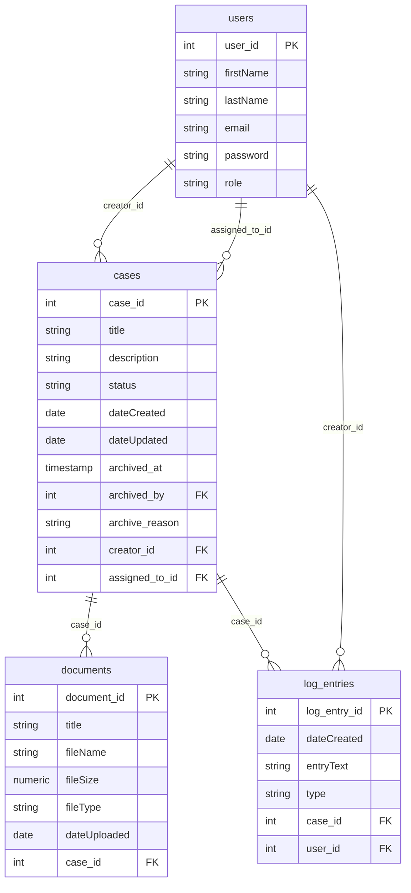

# ServePoint Data Model

Entity relationship diagram for the ORM models (cborm / ColdFusion ORM).

## Entity summary and ORM contract

| Entity      | Table        | Key relationships | Required (at creation) | Uniqueness / keys |
|------------|--------------|--------------------|------------------------|--------------------|
| Users      | users        | creator of cases, assignedTo cases, author of log_entries | `firstName`, `email`, `password`, `role` | `email` unique; PK `user_id` |
| Cases      | cases        | belongs to creator & assignedTo (Users); has many documents & log_entries | `title`, `status`, `dateCreated`, `creator` | PK `case_id`. Optional: `archivedAt`, `archivedBy`, `archiveReason`. Default case lists: active only (`archived_at IS NULL`). |
| Document   | documents    | belongs to one Case | `title`, `fileName`, `fileSize`, `fileType`, `dateUploaded`, `caseRef` | PK `document_id` |
| LogEntry   | log_entries  | belongs to one Case and one User | `dateCreated`, `entryText`, `type`, `caseRef`, `user` | PK `log_entry_id` |

### Index and constraint expectations (for migrations)

- **users**
  - Unique index on `email`.
- **cases**
  - Indexes on `status`, `creator_id`, `assigned_to_id`, `archived_at`.
- **documents**
  - Index on `case_id`.
- **log_entries**
  - Indexes on `case_id`, `user_id`, and optionally `type`.

## Constants (non-ORM)

Used for validation and dropdowns; not persisted as entities:

- **User_Role**: Citizen, Case Manager, Administrator
- **Case_Status**: (values defined in constants/Case_Status.cfc)
- **Document_File_Type**: (values defined in constants/Document_File_Type.cfc)
- **Log_Entry_Type**: (values defined in constants/Log_Entry_Type.cfc)

All persistent entities extend `cborm.models.ActiveEntity` and use `validate()` with the injected constant components.
