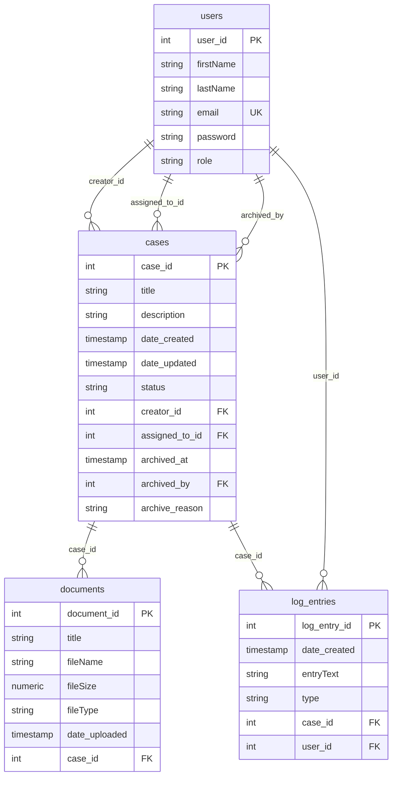

# ServePoint Data Model

Entity relationship diagram aligned with PostgreSQL physical columns (`resources/database/migrations`) and ORM mappings in `models/*.cfc`. ORM property names are camelCase; quoted mixed-case columns in `users` / `documents` map to those properties.

## Entity summary and ORM contract

| Entity      | Table        | Key relationships | Notes |
|------------|--------------|-------------------|--------|
| Users      | users        | creator / assignedTo / archivedBy cases; user for log_entries | `email` unique; PK `user_id` |
| Cases      | cases        | belongs to creator, assignedTo, archivedBy (Users); has many documents & log_entries | Active lists exclude rows with `archived_at IS NOT NULL`. `date_created` / `date_updated` are maintained by DB defaults and (on update) trigger — see migration `2026_03_27_000002_timestamp_defaults.cfc`. |
| Document   | documents    | belongs to one Case | PK `document_id`; `date_uploaded` has DB default |
| LogEntry   | log_entries  | belongs to one Case and one User | PK `log_entry_id`; FK `user_id` → users |

### Index and constraint expectations (for migrations)

- **users**: unique on `email`.
- **cases**: indexes on `status`, `creator_id`, `assigned_to_id`, `archived_at`.
- **documents**: index on `case_id`.
- **log_entries**: indexes on `case_id`, `user_id`, `type`.

## Constants (non-ORM)

Used for validation and dropdowns; live under `models/constants/`:

- **User_Role**, **Case_Status**, **Document_File_Type**, **Log_Entry_Type**

Persistent entities extend `cborm.models.ActiveEntity` and call `validate()` using the injected constant components where applicable.
