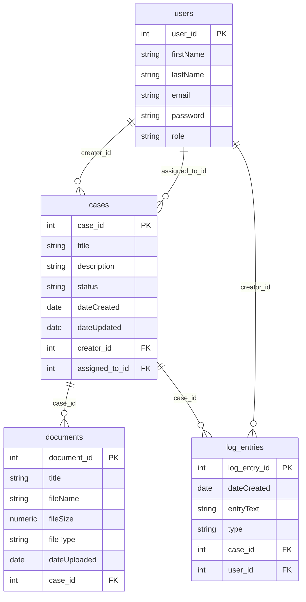

# ServePoint Data Model

Entity relationship diagram for the ORM models (cborm / ColdFusion ORM).

## Entity summary

| Entity      | Table        | Key relationships |
|------------|--------------|--------------------|
| Users      | users        | creator of cases, assignedTo cases, author of log_entries |
| Cases      | cases        | belongs to creator & assignedTo (Users); has many documents & log_entries |
| Document   | documents    | belongs to one Case |
| LogEntry   | log_entries  | belongs to one Case and one User |

## Constants (non-ORM)

Used for validation and dropdowns; not persisted as entities:

- **User_Role**: Citizen, Case Manager, Administrator
- **Case_Status**: (values defined in constants/Case_Status.cfc)
- **Document_File_Type**: (values defined in constants/Document_File_Type.cfc)
- **Log_Entry_Type**: (values defined in constants/Log_Entry_Type.cfc)

All persistent entities extend `cborm.models.ActiveEntity` and use `validate()` with the injected constant components.
