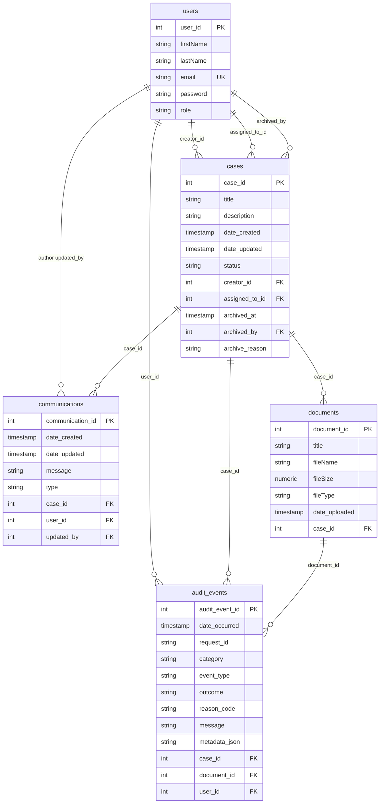

# ServePoint Data Model

Entity relationship diagram aligned with PostgreSQL physical columns (`resources/database/migrations`) and ORM mappings in `models/*.cfc`. ORM property names are camelCase; quoted mixed-case columns in `users` / `documents` map to those properties.

```mermaid
erDiagram
    users ||--o{ cases : "creator_id"
    users ||--o{ cases : "assigned_to_id"
    users ||--o{ cases : "archived_by"
    users ||--o{ audit_events : "user_id"
    users ||--o{ communications : "author updated_by"
    cases ||--o{ documents : "case_id"
    cases ||--o{ audit_events : "case_id"
    cases ||--o{ communications : "case_id"
    documents ||--o{ audit_events : "document_id"

    users {
        int user_id PK
        string firstName
        string lastName
        string email UK
        string password
        string role
    }

    cases {
        int case_id PK
        string title
        string description
        timestamp date_created
        timestamp date_updated
        string status
        int creator_id FK
        int assigned_to_id FK
        timestamp archived_at
        int archived_by FK
        string archive_reason
    }

    documents {
        int document_id PK
        string title
        string fileName
        numeric fileSize
        string fileType
        timestamp date_uploaded
        int case_id FK
    }

    communications {
        int communication_id PK
        timestamp date_created
        timestamp date_updated
        string message
        string type
        int case_id FK
        int user_id FK
        int updated_by FK
    }

    audit_events {
        int audit_event_id PK
        timestamp date_occurred
        string request_id
        string category
        string event_type
        string outcome
        string reason_code
        string message
        string metadata_json
        int case_id FK
        int document_id FK
        int user_id FK
    }
```

## Entity summary and ORM contract

| Entity      | Table        | Key relationships | Notes |
|------------|--------------|-------------------|--------|
| Users      | users        | creator / assignedTo / archivedBy cases; optional actor for `audit_events`; author & optional `updated_by` for communications | `email` unique; PK `user_id` |
| Cases      | cases        | belongs to creator, assignedTo, archivedBy (Users); has many documents, audit events, communications | Active lists exclude rows with `archived_at IS NOT NULL`. `date_created` / `date_updated` are maintained by DB defaults and (on update) trigger — see migration `2026_03_27_000002_timestamp_defaults.cfc`. |
| Document   | documents    | belongs to one Case | PK `document_id`; `date_uploaded` has DB default. Rows represent **retained** case records; the app does not delete them from upload/view flows—see **Document retention** below. |
| Communication | communications | belongs to one Case and one User (author); optional `updated_by` (User) for future edits | **Staff communications** (human notes). PK `communication_id`; `date_updated` trigger — migration `2026_04_03_000001_communications.cfc`. In **development**, `SeedService` adds idempotent demo rows when the table is empty. |
| AuditEvent | audit_events | optional links to User (actor), Case, Document | Primary structured audit stream for new instrumentation (`category`, `event_type`, `outcome`, `reason_code`, sanitized `message`, redacted `metadata_json`). Used by reporting queries and future auth events. |

### Index and constraint expectations (for migrations)

- **users**: unique on `email`.
- **cases**: indexes on `status`, `creator_id`, `assigned_to_id`, `archived_at`.
- **documents**: index on `case_id`.
- **communications**: indexes on `case_id`, `user_id`, `type`.
- **audit_events**: indexes on `date_occurred`, `(category, event_type)`, `user_id`, `case_id`, `document_id`.

## Document retention (product / policy)

The `documents` table and files on disk under `SERVEPOINT_DOCUMENT_STORAGE_ROOT` are treated as **durable case evidence**. There is **no** in-application **delete** action alongside upload and download for routine users. Removing or purging data follows **records disposition** outside those UI flows (`docs/DESIGN_NOTES.md`, `docs/DEV_NOTES.md`). Soft **case** archive changes what active-case queries return; it does **not** imply document row or file removal.

## Constants (non-ORM)

Used for validation and dropdowns; live under `models/constants/`:

- **User_Role**, **Case_Status**, **Document_File_Type**, **Communication_Type**, **Audit_Category**, **Audit_Event_Type**, **Audit_Outcome**

Persistent entities extend `cborm.models.ActiveEntity` and call `validate()` using the injected constant components where applicable.
