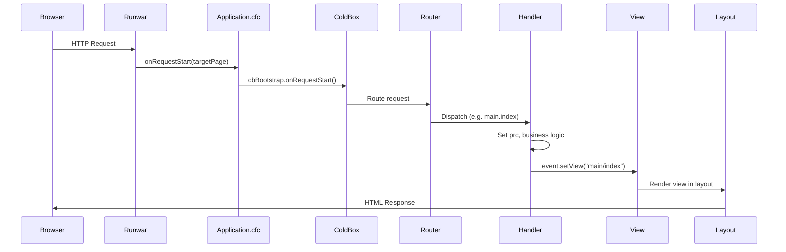
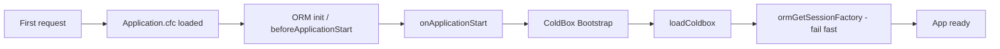

# ServePoint Request Lifecycle

Flow of an HTTP request from the browser through ColdBox and back.

## Application startup (once)

## Key files

- **Application.cfc**: `onRequestStart` delegates to ColdBox; `onApplicationStart` boots ColdBox and forces ORM init.
- **config/Router.cfc**: Routes (e.g. `/healthcheck`, `/api/echo`, `:handler/:action?`).
- **handlers/Main.cfc**: Default handler (index, underConstruction, data, etc.).
- **views/main/*.cfm**, **layouts/Main.cfm**: View and layout rendering.
