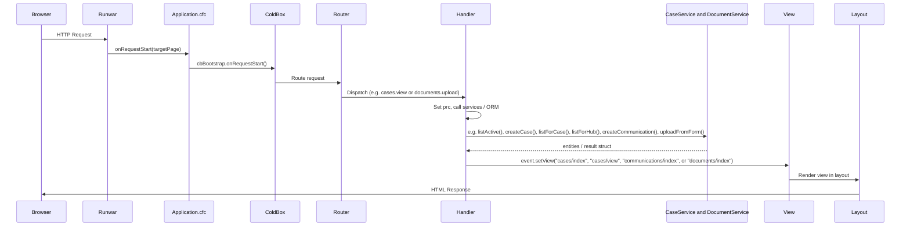
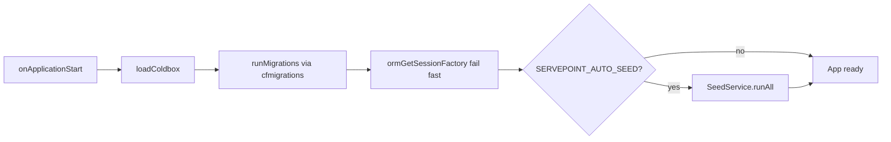

# ServePoint Request Lifecycle

Flow of an HTTP request from the browser through ColdBox and back.

Note: handlers that do not use a service (for example `Main.index`) skip the service participant.

## Application startup (once)

`onApplicationStart` runs migrations before ORM init and optional seeding.

## Key files

- **Application.cfc**: `onRequestStart` delegates to ColdBox; `onApplicationStart` loads ColdBox, runs DB migrations, initializes ORM, optionally runs `SeedService`.
- **config/Router.cfc**: `/healthcheck`, `/api/echo`, convention route `:handler/:action?`.
- **handlers/Main.cfc**: Home, under construction, sample `data` JSON.
- **handlers/Cases.cfc**: Case list, detail/edit, create, archive, POST `addCommunication` (staff notes on active cases).
- **handlers/Communications.cfc**: Read-only communications hub (`communications.index`) with optional filters (case, type, author).
- **handlers/Documents.cfc**: Document upload and download actions, scoped to active cases. **No delete** in routine flows—see document retention in `DESIGN_NOTES.md` / `DEV_NOTES.md`.
- **views/documents/index.cfm**: Standalone document workspace (select case, upload, list, download).
- **services/CaseService.cfc**: Active-case queries, create/update/archive.
- **services/CommunicationService.cfc**: List/create communications for active cases, ordered activity log entries per case, hub listing with filters.
- **services/DocumentService.cfc**: Upload validation/storage, document listing by case, download resolution.

## Document retention (design)

Accepted documents are **retained** as part of the case record. Upload/view/download paths do **not** implement user-facing **deletion**; disposition is **out of band** (policy, admin process, or future controlled tooling). Case **archive** limits visibility for active workflows but does **not** remove `documents` rows or stored files.
- **views/cases/\*.cfm**, **views/communications/index.cfm**, **views/main/\*.cfm**, **layouts/Main.cfm**: View and layout rendering.
