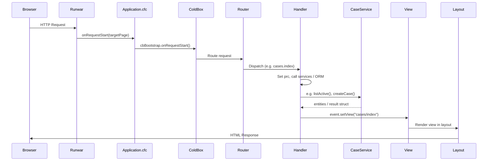
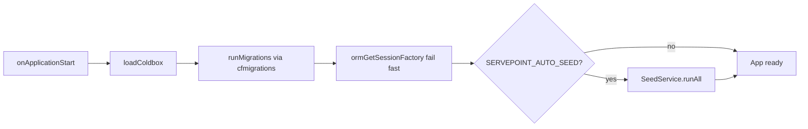

# ServePoint Request Lifecycle

Flow of an HTTP request from the browser through ColdBox and back.

Note: handlers that do not use a service (for example `Main.index`) skip the service participant.

## Application startup (once)

`onApplicationStart` runs migrations before ORM init and optional seeding.

## Key files

- **Application.cfc**: `onRequestStart` delegates to ColdBox; `onApplicationStart` loads ColdBox, runs DB migrations, initializes ORM, optionally runs `SeedService`.
- **config/Router.cfc**: `/healthcheck`, `/api/echo`, convention route `:handler/:action?`.
- **handlers/Main.cfc**: Home, under construction, sample `data` JSON.
- **handlers/Cases.cfc**: Case list, detail/edit, create, archive; uses `CaseService`.
- **services/CaseService.cfc**: Active-case queries, create/update/archive.
- **views/cases/*.cfm**, **views/main/*.cfm**, **layouts/Main.cfm**: View and layout rendering.
